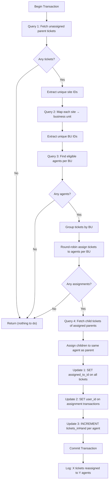
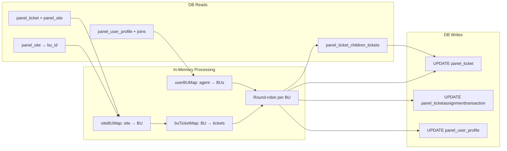

# `DistributeNoAgent` — Detailed Summary

> **File:** [`distribute_no_agent.go`](file:///c:/Users/dhruv.patil/Desktop/Ticket_Automation/ticket_automation/internal/db/distribute_no_agent.go)

## Purpose

This function takes all open parent tickets currently assigned to a **"No Agent"** placeholder user and **redistributes them to real, active agents** using a round-robin strategy within each business unit. The entire operation runs inside a **single database transaction** — if anything fails, all changes are rolled back.

---

## Complete Flow Diagram



---

## Step-by-Step Breakdown

### Step 1 — Setup (Lines 9–20)

| Item | Detail |
|---|---|
| **Transaction** | `tx, err := DB.Begin(ctx)` — opens a DB transaction |
| **Rollback safety** | `defer tx.Rollback(ctx)` — auto-rollback if function exits without commit |
| **Time variables** | `currentTime` = now, `compareTime` = 5 minutes ago (used for agent liveness check) |

---

### Step 2 — Query 1: Fetch unassigned parent tickets (Lines 22–53)

```sql
SELECT pt.id, pt.site_id
FROM panel_ticket pt
JOIN panel_site ps ON ps.id = pt.site_id
WHERE pt.assigned_to_id = $1          -- NoAgentID
  AND pt.is_parent = TRUE
  AND pt.closed = FALSE
  AND ps.enterprise_id != 34
```

**What it does:**
- Finds all **open parent tickets** currently assigned to the "No Agent" user
- Joins with `panel_site` to **exclude enterprise 34**
- Returns `ticket.ID` and `ticket.SiteID` for each match

**Result:** `tickets []Ticket` — list of tickets needing reassignment

> [!NOTE]
> Only **parent** tickets are fetched here. Child tickets are handled separately in Step 6.

---

### Step 3 — Extract unique site IDs (Lines 55–70)

**What it does:**
- Loops through `tickets` and collects all **unique** `SiteID` values
- Uses a `siteSet` map to deduplicate

**Result:** `siteIDs []int64` — deduplicated list of site IDs

---

### Step 4 — Query 2: Map sites to business units (Lines 72–105)

```sql
SELECT id, bu_id
FROM panel_site
WHERE id = ANY($1)
```

**What it does:**
- For each site from Step 3, looks up which **business unit (BU)** it belongs to
- Then extracts unique BU IDs into a separate list

**Results:**
- `siteBUMap[siteID] → buID` — which BU each site belongs to
- `buIDs []int64` — deduplicated list of all relevant BU IDs

**Example:**

| Site ID | BU ID |
|---------|-------|
| 100 | 1 |
| 101 | 1 |
| 200 | 2 |
| 300 | 3 |

→ `buIDs = [1, 2, 3]`

---

### Step 5 — Query 3: Find eligible agents (Lines 112–153)

```sql
SELECT up.id, up.user_id, bub.business_unit_id
FROM panel_user_profile up
JOIN auth_user u ON up.user_id = u.id
JOIN panel_user_profile_bu bub
    ON bub.user_profile_id = up.id
JOIN panel_business_unit pbu
    ON pbu.id = bub.business_unit_id
WHERE up.on_break = FALSE
  AND up.on_shift_end = FALSE
  AND up.role = 'agent'
  AND bub.business_unit_id = ANY($1)
  AND up.last_active >= $2
  AND pbu.enterprise_id != 34
```

**What it does:**
- Finds agents who are:
  - ✅ **Not on break** (`on_break = FALSE`)
  - ✅ **Not on shift end** (`on_shift_end = FALSE`)
  - ✅ **Role is 'agent'**
  - ✅ **Belong to a relevant BU** (from Step 4)
  - ✅ **Active in the last 5 minutes** (`last_active >= compareTime`)
  - ✅ **Not in enterprise 34**

**Results:**
- `userBUMap[UserKey{ProfileID, UserID}] → set of BU IDs` — each agent and which BUs they can serve
- `userQueue []UserKey` — flat list of all available agents

**Example:**

| Agent (Profile, User) | BUs they serve |
|---|---|
| `{10, 100}` | `{1, 3}` |
| `{11, 101}` | `{1}` |
| `{12, 102}` | `{2, 3}` |

> [!IMPORTANT]
> An agent can belong to **multiple BUs**. They will be eligible for tickets in any of their BUs.

---

### Step 6 — Group tickets by BU & round-robin assignment (Lines 165–214)

**What it does (two parts):**

#### Part A: Group tickets by BU
For each ticket, looks up its `siteID → buID` mapping and groups tickets under their BU:

| BU ID | Tickets |
|---|---|
| 1 | `[T1, T2, T3]` |
| 2 | `[T4]` |
| 3 | `[T5, T6]` |

#### Part B: Round-robin assignment per BU
For each BU:
1. Filter agents from `userQueue` who are eligible for this BU
2. Assign tickets in **round-robin** order: `eligible[index % len(eligible)]`

**Example** — BU 1 has 3 tickets and 2 eligible agents:

| Ticket | `index % 2` | Assigned Agent |
|---|---|---|
| T1 | 0 | Agent A |
| T2 | 1 | Agent B |
| T3 | 0 | Agent A |

**Tracking structures:**
- `assignments []Assignment` — all `{TicketID, UserID, ProfileID}` pairs
- `parentToUser[ticketID] → Assignment` — parent-to-agent map (for child propagation)
- `ticketsPerProfile[profileID] → []ticketIDs` — count tracker (for updating `tickets_inHand`)

---

### Step 7 — Query 4: Fetch & assign child tickets (Lines 226–256)

```sql
SELECT from_ticket_id, to_ticket_id
FROM panel_ticket_children_tickets
WHERE from_ticket_id = ANY($1)
```

**What it does:**
- For each assigned parent ticket, finds all its **child tickets**
- Each child is assigned to the **same agent as its parent** (looked up from `parentToUser`)
- Children are added to both `assignments` and `ticketsPerProfile`

**Example:** Parent T1 → Agent A, children `[T7, T8]` → both also assigned to Agent A

> [!TIP]
> This ensures a single agent handles the **entire ticket tree** (parent + all children), keeping context together.

---

### Step 8 — Update 1: Reassign all tickets (Lines 258–270)

```sql
UPDATE panel_ticket
SET assigned_to_id = $1,
    assigned_at = $2
WHERE id = $3
```

**What it does:**
- Runs for **every assignment** (both parents and children)
- Changes `assigned_to_id` from NoAgentID → the real agent's `UserID`
- Stamps `assigned_at` with `currentTime`

---

### Step 9 — Update 2: Update assignment transaction log (Lines 272–283)

```sql
UPDATE panel_ticketassignmenttransaction
SET user_id = $1
WHERE parent_ticket_id = $2
```

**What it does:**
- Runs for **parent tickets only**
- Updates the assignment transaction record to reflect the new agent

---

### Step 10 — Update 3: Increment agent ticket count (Lines 285–296)

```sql
UPDATE panel_user_profile
SET "tickets_inHand" = "tickets_inHand" + $1
WHERE id = $2
```

**What it does:**
- Runs for **each agent profile**
- Adds the total number of newly assigned tickets (parents + children) to the agent's `tickets_inHand` counter

**Example:** Agent A got T1, T3, T7, T8 → `tickets_inHand += 4`

---

### Step 11 — Commit & log (Lines 298–308)

```go
tx.Commit(ctx)
```

- If everything succeeded → **commit** all changes permanently
- If anything failed earlier → function returned early → **deferred rollback** undoes everything
- Logs: `"X tickets reassigned to Y agents"`

---

## Data Flow Summary



---

## Key Design Decisions

| Decision | Rationale |
|---|---|
| **Single transaction** | All-or-nothing — either every ticket is reassigned or none are |
| **Round-robin per BU** | Even distribution within each BU; agents only get tickets from BUs they belong to |
| **Children inherit parent's agent** | Keeps full ticket context with one agent |
| **5-minute liveness window** | Prevents assigning to offline/idle agents |
| **Enterprise 34 excluded** | Filtered at both ticket AND agent level — likely a special/internal enterprise |
| **`defer tx.Rollback`** | Safe cleanup — `Rollback` is a no-op after a successful `Commit` |
