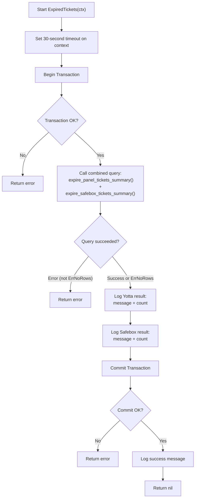
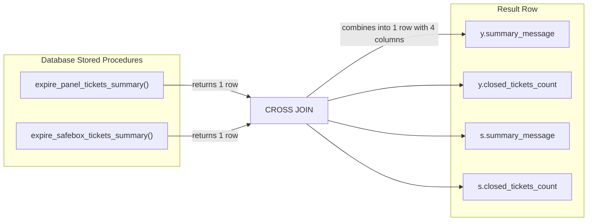
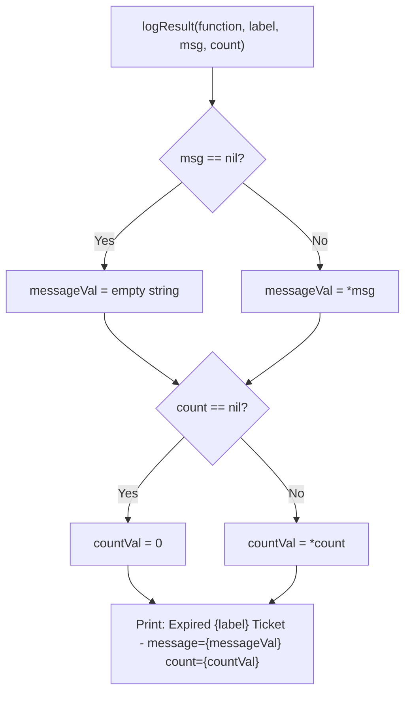
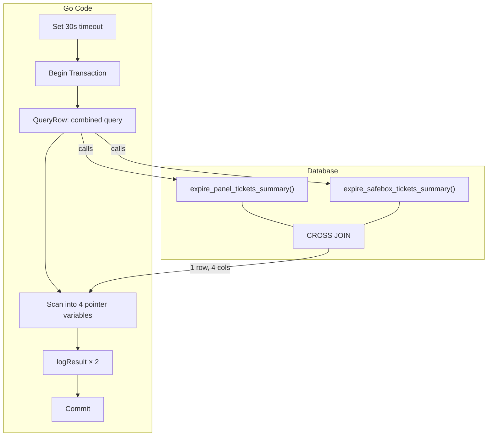

# `ExpiredTickets` — Detailed Summary

> **File:** [`expired_ticket.go`](file:///c:/Users/dhruv.patil/Desktop/Ticket_Automation/ticket_automation/internal/db/expired_ticket.go)

---

## Purpose

Expires tickets that have exceeded their time limit by calling **two database stored procedures** — one for Yotta panel tickets and one for Safebox tickets. The Go code acts as an orchestrator: it opens a transaction, calls the procedures, logs the results, and commits.

---

## Complete Flow Diagram



---

## Step-by-Step Breakdown

### Step 1 — Timeout Guard (Lines 19–20)

```go
ctx, cancel := context.WithTimeout(ctx, 30*time.Second)
defer cancel()
```

| Detail | Value |
|---|---|
| **Timeout** | 30 seconds |
| **Why** | Stored procedures run inside the DB — if they hang or take too long, this kills the operation |
| **`defer cancel()`** | Cleans up the context timer when the function exits |

> [!IMPORTANT]
> This is the only function among the three (`DistributeNoAgent`, `InactiveUsers`, `ExpiredTickets`) that enforces a hard timeout. The others have no timeout protection.

---

### Step 2 — Begin Transaction (Lines 23–27)

```go
tx, err := DB.Begin(ctx)
if err != nil {
    return fmt.Errorf("%s unable to begin transaction: %w", logPrefix(function), err)
}
defer tx.Rollback(ctx)
```

| Detail | Description |
|---|---|
| **Transaction** | Opens a DB transaction |
| **Rollback safety** | `defer tx.Rollback(ctx)` — auto-rollback if function exits without commit |
| **Error handling** | Returns a wrapped error (unlike the other functions which just print and return) |

---

### Step 3 — Call Stored Procedures (Lines 36–49)

```sql
SELECT 
    y.summary_message, y.closed_tickets_count,
    s.summary_message, s.closed_tickets_count
FROM expire_panel_tickets_summary() y
CROSS JOIN public.expire_safebox_tickets_summary() s;
```

#### How the query works



| Procedure | Alias | What it expires |
|---|---|---|
| `expire_panel_tickets_summary()` | `y` | **Yotta** panel tickets |
| `public.expire_safebox_tickets_summary()` | `s` | **Safebox** tickets |

Each returns:

| Column | Go Variable | Type | Description |
|---|---|---|---|
| `summary_message` | `yottaMsg` / `safeboxMsg` | `*string` | Text summary of what was done |
| `closed_tickets_count` | `yottaCount` / `safeboxCount` | `*int64` | Number of tickets closed |

#### Go scan code

```go
err = tx.QueryRow(ctx, combinedQuery).Scan(
    &yottaMsg, &yottaCount,
    &safeboxMsg, &safeboxCount,
)
```

- Uses `QueryRow` (not `Query`) because we expect **exactly one row**
- Variables are **pointers** (`*string`, `*int64`) so they can hold SQL `NULL`

#### Error handling

```go
if err != nil && !errors.Is(err, pgx.ErrNoRows) {
    return fmt.Errorf("...")
}
```

- If the procedures return **no rows** (`pgx.ErrNoRows`) → that's OK, continue
- Any **other error** → return it

> [!NOTE]
> `pgx.ErrNoRows` is silently ignored because it's valid for the procedures to process zero tickets and return nothing.

---

### Step 4 — Log Results (Lines 53–54)

```go
logResult(function, "Yotta", yottaMsg, yottaCount)
logResult(function, "Safebox", safeboxMsg, safeboxCount)
```

Calls the helper function twice — once per procedure.

---

### Step 5 — Commit (Lines 57–62)

```go
if err := tx.Commit(ctx); err != nil {
    return fmt.Errorf("%s commit failed: %w", logPrefix(function), err)
}
fmt.Printf("%s Expired tickets processed successfully.\n", logPrefix(function))
return nil
```

If commit succeeds → log success and return `nil`.

---

## `logResult` Helper Function (Lines 66–84)



**Why this exists:**
- The stored procedures can return SQL `NULL` for either field
- In Go, `NULL` maps to `nil` pointers
- Printing a `nil` pointer directly shows a memory address like `0xc0000b2050`
- This helper **safely dereferences** the pointers, defaulting to `""` and `0`

**Example output:**
```
[expired_tickets] Expired Yotta Ticket - message=Closed 5 expired tickets count=5
[expired_tickets] Expired Safebox Ticket - message= count=0
```

---

## Data Flow Summary



---

## Comparison with Other Functions

| Aspect | `DistributeNoAgent` | `InactiveUsers` | `ExpiredTickets` |
|---|---|---|---|
| **Logic location** | Go code | Go code | **DB stored procedures** |
| **Queries** | 4 SELECTs + 3 UPDATEs | 4 SELECTs + 4 UPDATEs | **1 combined SELECT** |
| **Return type** | `void` | `void` | **`error`** |
| **Timeout** | None | None | **30 seconds** |
| **Error style** | `fmt.Printf` + `return` | `fmt.Printf` + `return` | **`fmt.Errorf` + `return err`** |
| **NULL handling** | N/A | N/A | **Pointer dereferencing via `logResult`** |
| **Round-robin** | Yes | Yes | **No** (no assignment logic) |
| **Lines of code** | ~309 | ~322 | **~84** |
