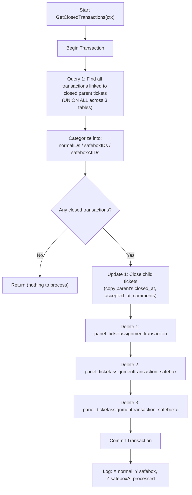
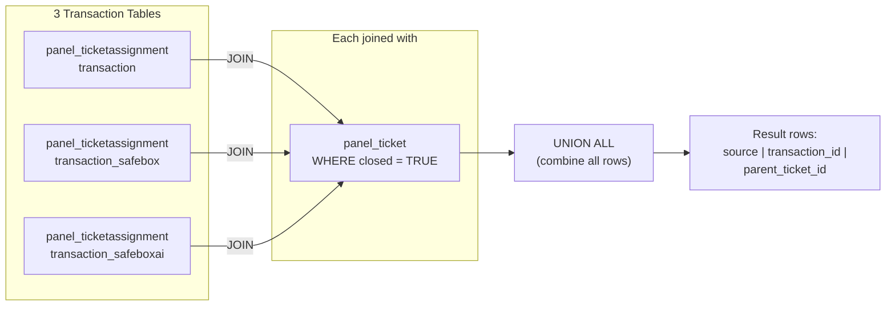
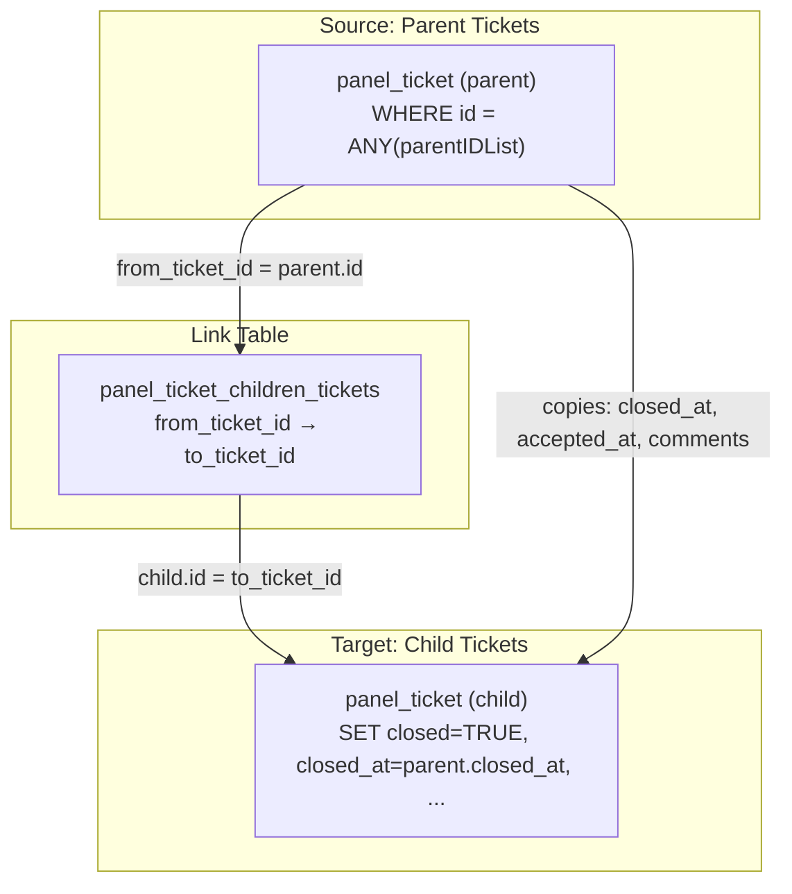
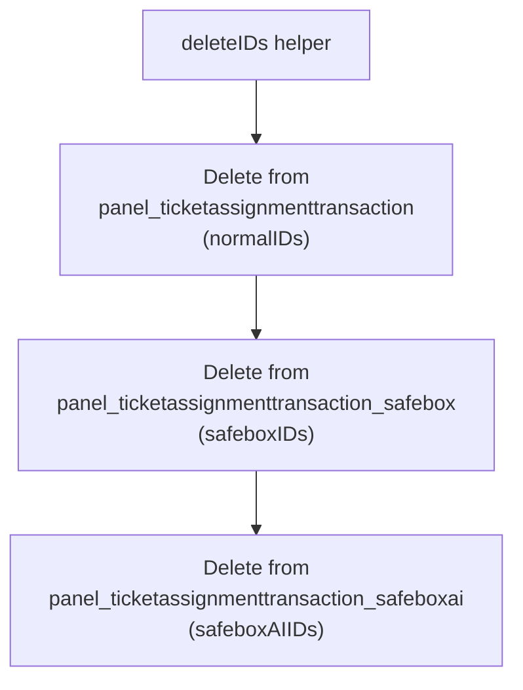
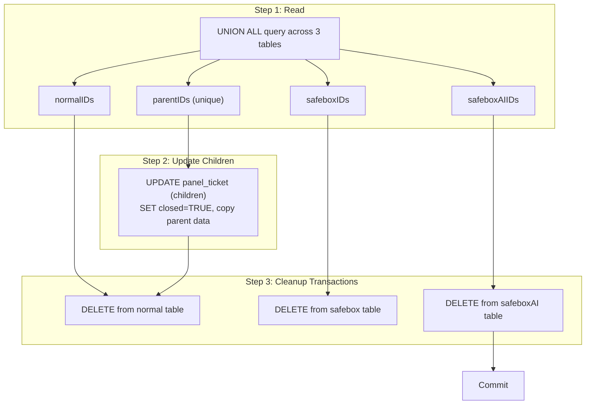

# `GetClosedTransactions` — Detailed Summary

> **File:** [`get_closed_transaction.go`](file:///c:/Users/dhruv.patil/Desktop/Ticket_Automation/ticket_automation/internal/db/get_closed_transaction.go)

---

## Purpose

This function **cleans up after tickets are closed**. When a parent ticket is closed, this function:
1. **Finds** all assignment transactions linked to closed parent tickets (across 3 tables)
2. **Closes child tickets** by copying the parent's closure data
3. **Deletes** the assignment transaction records (cleanup)

---

## Complete Flow Diagram



---

## Step-by-Step Breakdown

### Step 1 — Begin Transaction (Lines 14–20)

```go
tx, err := DB.Begin(ctx)
defer tx.Rollback(ctx)
```

Standard transaction setup with deferred rollback safety.

---

### Step 2 — Query 1: Find all transactions for closed tickets (Lines 22–56)

```sql
SELECT 'normal' AS source, tat.id, pt.id
FROM panel_ticketassignmenttransaction tat
JOIN panel_ticket pt ON tat.parent_ticket_id = pt.id
WHERE pt.closed = TRUE

UNION ALL

SELECT 'safebox' AS source, tat.id, pt.id
FROM panel_ticketassignmenttransaction_safebox tat
JOIN panel_ticket pt ON tat.parent_ticket_id = pt.id
WHERE pt.closed = TRUE

UNION ALL

SELECT 'safeboxai' AS source, tat.id, pt.id
FROM panel_ticketassignmenttransaction_safeboxai tat
JOIN panel_ticket pt ON tat.parent_ticket_id = pt.id
WHERE pt.closed = TRUE
```

#### How the UNION ALL works



**What it does:**
- Searches **3 different transaction tables** for records linked to closed parent tickets
- Each sub-query adds a `source` label (`'normal'`, `'safebox'`, `'safeboxai'`) so Go code can categorize them
- `UNION ALL` combines all results into a single result set (keeps duplicates, unlike `UNION`)

**Why 3 tables?** The system has 3 types of ticket assignment workflows:

| Table | Type | Description |
|---|---|---|
| `panel_ticketassignmenttransaction` | Normal | Standard ticket assignments |
| `panel_ticketassignmenttransaction_safebox` | Safebox | Safebox ticket assignments |
| `panel_ticketassignmenttransaction_safeboxai` | Safebox AI | AI-powered safebox assignments |

---

### Step 3 — Categorize results (Lines 58–86)

```go
for rows.Next() {
    var source string
    var transactionID, parentID int64
    rows.Scan(&source, &transactionID, &parentID)

    parentIDs[parentID] = struct{}{}

    switch source {
    case "normal":    normalIDs = append(normalIDs, transactionID)
    case "safebox":   safeboxIDs = append(safeboxIDs, transactionID)
    case "safeboxai": safeboxAIIDs = append(safeboxAIIDs, transactionID)
    }
}
```

**What it does:**
- Iterates through all rows from the UNION ALL query
- Uses the `source` label to sort transaction IDs into 3 separate slices
- Collects all unique `parentID`s into a deduplicated set

**Result:**

| Variable | Contents |
|---|---|
| `normalIDs` | `[101, 102, 103, ...]` — transaction IDs from normal table |
| `safeboxIDs` | `[201, 202, ...]` — transaction IDs from safebox table |
| `safeboxAIIDs` | `[301, ...]` — transaction IDs from safebox AI table |
| `parentIDs` | `{10: {}, 20: {}, 30: {}}` — unique closed parent ticket IDs |

> [!NOTE]
> `rows.Err()` is checked after the loop (line 88) — this catches any errors that occurred during iteration but weren't caught by individual `Scan` calls.

---

### Step 4 — Update 1: Close child tickets (Lines 100–113)

```sql
UPDATE panel_ticket AS child
SET
    closed = TRUE,
    closed_at = parent.closed_at,
    "isAccepted" = TRUE,
    accepted_at = parent.accepted_at,
    comments = parent.comments
FROM panel_ticket_children_tickets ct
JOIN panel_ticket AS parent ON ct.from_ticket_id = parent.id
WHERE child.id = ct.to_ticket_id
AND parent.id = ANY($1)
```

#### How this update works



**What it does:**
- For each closed parent ticket, finds all its **child tickets** via the `panel_ticket_children_tickets` link table
- **Copies** the parent's closure data to each child:

| Child field set to | Value copied from parent |
|---|---|
| `closed` | `TRUE` |
| `closed_at` | `parent.closed_at` |
| `"isAccepted"` | `TRUE` |
| `accepted_at` | `parent.accepted_at` |
| `comments` | `parent.comments` |

> [!IMPORTANT]
> This is a **multi-table UPDATE** using PostgreSQL's `FROM` clause. The `child` alias targets the rows being updated, while `parent` provides the source data through the join.

---

### Step 5 — Delete assignment transactions (Lines 115–143)

#### The `deleteIDs` helper function

```go
deleteIDs := func(table string, ids []int64) error {
    if len(ids) == 0 {
        return nil  // skip if nothing to delete
    }
    query := fmt.Sprintf(`DELETE FROM %s WHERE id = ANY($1)`, table)
    _, err := tx.Exec(ctx, query, ids)
    return err
}
```

This is a **closure** (inline function) that deletes records by ID from any given table. It's called 3 times:



| Call # | Table | IDs deleted |
|---|---|---|
| 1 | `panel_ticketassignmenttransaction` | `normalIDs` |
| 2 | `panel_ticketassignmenttransaction_safebox` | `safeboxIDs` |
| 3 | `panel_ticketassignmenttransaction_safeboxai` | `safeboxAIIDs` |

> [!NOTE]
> If any ID list is empty, that delete is **skipped** (`return nil`). So if there are no safebox transactions, that delete is a no-op.

> [!WARNING]
> The table name is injected via `fmt.Sprintf` — this is safe here because the table names are **hardcoded strings**, not user input. But in general, string-interpolated table names can be a SQL injection risk.

---

### Step 6 — Commit & Log (Lines 145–157)

```go
if err := tx.Commit(ctx); err != nil { ... }

fmt.Printf(
    "%s Processed %d normal, %d safebox and %d safebox AI transactions.\n",
    logPrefix(function),
    len(normalIDs), len(safeboxIDs), len(safeboxAIIDs),
)
```

Commits all changes and logs how many transactions were processed per type.

---

## Full Query & Update Summary

| # | Type | Table(s) | Purpose |
|---|---|---|---|
| **Q1** | `SELECT` (UNION ALL) | 3 transaction tables + `panel_ticket` | Find all transactions for closed tickets |
| **U1** | `UPDATE` | `panel_ticket` (children) via `panel_ticket_children_tickets` | Close child tickets with parent's data |
| **D1** | `DELETE` | `panel_ticketassignmenttransaction` | Remove normal transaction records |
| **D2** | `DELETE` | `panel_ticketassignmenttransaction_safebox` | Remove safebox transaction records |
| **D3** | `DELETE` | `panel_ticketassignmenttransaction_safeboxai` | Remove safebox AI transaction records |

---

## Data Flow Summary



---

## Comparison with All Four Functions

| Aspect | `DistributeNoAgent` | `InactiveUsers` | `ExpiredTickets` | `GetClosedTransactions` |
|---|---|---|---|---|
| **Purpose** | Assign NoAgent tickets | Handle idle agents | Expire old tickets | Cleanup after closure |
| **Main action** | Reassign tickets | Mark shift-end + reassign | Call stored procedures | Close children + delete transactions |
| **Queries** | 4 SELECT + 3 UPDATE | 4 SELECT + 4 UPDATE | 1 SELECT | 1 SELECT + 1 UPDATE + 3 DELETE |
| **Round-robin** | ✅ | ✅ | ❌ | ❌ |
| **Deletes data** | ❌ | ❌ | ❌ | ✅ |
| **Return type** | `void` | `void` | `error` | `void` |
| **Timeout** | None | None | 30s | None |
