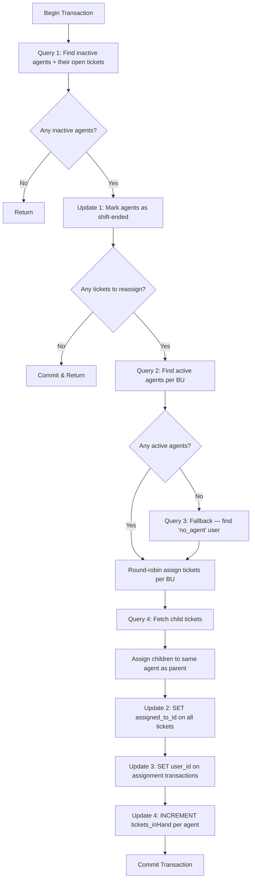

# `InactiveUsers` — Detailed Summary

> **File:** [`inactive_users.go`](file:///c:/Users/dhruv.patil/Desktop/Ticket_Automation/ticket_automation/internal/db/inactive_users.go)

## Purpose

This function handles **agents who have gone inactive** (no activity for 15+ minutes). It:
1. **Marks them as shift-ended** (`on_shift_end = TRUE`)
2. **Redistributes their open parent tickets** to available active agents via round-robin
3. **Falls back to "No Agent"** if no active agents are available

Everything runs inside a **single transaction** — all-or-nothing.

---

## How it differs from `DistributeNoAgent`

| Aspect | `DistributeNoAgent` | `InactiveUsers` |
|---|---|---|
| **Trigger** | Tickets assigned to NoAgentID | Agents inactive for 15+ min |
| **First action** | — | Marks inactive agents as shift-ended |
| **Ticket source** | Tickets with `assigned_to_id = NoAgentID` | Tickets belonging to inactive agents |
| **Fallback** | No fallback (skips if no agents) | Falls back to `no_agent` user |
| **BU lookup** | Separate query for site → BU | Gets BU directly in the initial query |
| **`ticketOldUserMap`** | Not tracked | Tracks the previous agent per ticket (unused currently) |

---

## Complete Flow Diagram



---

## Step-by-Step Breakdown

### Step 1 — Setup (Lines 10–23)

| Item | Detail |
|---|---|
| **Transaction** | `tx, err := DB.Begin(ctx)` |
| **Rollback safety** | `defer tx.Rollback(ctx)` |
| **`currentTime`** | Now — used for `assigned_at` timestamps |
| **`compare15Min`** | 15 minutes ago — threshold for "inactive" agents |
| **`compare5Min`** | 5 minutes ago — threshold for "active" replacement agents |

---

### Step 2 — Query 1: Find inactive agents and their tickets (Lines 25–48)

```sql
SELECT up.id, up.user_id, t.id, s.bu_id, t.site_id
FROM panel_user_profile up
JOIN auth_user u ON up.user_id = u.id
LEFT JOIN panel_ticket t
    ON t.assigned_to_id = up.user_id
    AND t.is_parent = TRUE
    AND t.closed = FALSE
LEFT JOIN panel_site s ON s.id = t.site_id
WHERE up.last_active < $1            -- inactive for 15+ min
  AND s.enterprise_id != 34
  AND up.role = 'agent'
  AND u.username != 'no_agent'
```

**What it does:**
- Finds all agents who have been **inactive for 15+ minutes**
- Uses `LEFT JOIN` on tickets — so agents **without tickets** are still found (they need to be marked shift-ended)
- Uses `LEFT JOIN` on sites — to get the `bu_id` for each ticket
- Excludes enterprise 34 and the `no_agent` user

**Results collected:**

| Variable | Type | Purpose |
|---|---|---|
| `profileIDs` | `map[int64]struct{}` | Unique profile IDs of all inactive agents |
| `ticketList` | `[]Ticket` | All open parent tickets of inactive agents |
| `ticketBUMap` | `map[ticketID → buID]` | Which BU each ticket belongs to |
| `ticketOldUserMap` | `map[ticketID → userID]` | Original agent per ticket (tracked but unused) |
| `buSet` | `map[int64]struct{}` | Unique BU IDs involved |

> [!NOTE]
> **`LEFT JOIN`** is important here. An inactive agent may have **zero tickets** but still needs to be marked as shift-ended. The `LEFT JOIN` ensures these agents aren't filtered out.

---

### Step 3 — Update 1: Mark inactive agents as shift-ended (Lines 90–98)

```sql
UPDATE panel_user_profile
SET on_shift_end = TRUE
WHERE id = ANY($1)
```

**What it does:**
- Sets `on_shift_end = TRUE` for all inactive agents
- This **prevents them from receiving new tickets** in future runs

> [!IMPORTANT]
> This runs **before** ticket reassignment. If no tickets need reassignment, the function commits early after just this update.

---

### Step 4 — Early exit if no tickets (Lines 100–106)

If `ticketList` is empty (agents were inactive but had no open tickets), the function **commits** the shift-end update and returns early. No further queries are needed.

---

### Step 5 — Query 2: Find active replacement agents (Lines 112–131)

```sql
SELECT up.id, up.user_id, pupb.business_unit_id
FROM panel_user_profile up
JOIN auth_user u ON up.user_id = u.id
JOIN panel_user_profile_bu pupb
    ON pupb.user_profile_id = up.id
JOIN panel_business_unit pbu
    ON pbu.id = pupb.business_unit_id
WHERE up.on_break = FALSE
  AND up.on_shift_end = FALSE
  AND up.role = 'agent'
  AND pupb.business_unit_id = ANY($1)
  AND up.last_active >= $2
  AND pbu.enterprise_id != 34
```

**What it does:**
- Finds agents who are:
  - ✅ Not on break
  - ✅ Not marked as shift-ended (already excludes the agents we just marked)
  - ✅ Role is `'agent'`
  - ✅ Belong to one of the affected BUs
  - ✅ Active in the last 5 minutes
  - ✅ Not in enterprise 34

**Result:** `agentsByBU[buID] → []Agent` — available agents grouped by BU

---

### Step 6 — Query 3: Fallback to "No Agent" (Lines 147–175)

```sql
SELECT up.id, up.user_id, pupb.business_unit_id
FROM panel_user_profile up
JOIN auth_user u ON up.user_id = u.id
JOIN panel_user_profile_bu pupb
    ON pupb.user_profile_id = up.id
WHERE u.username = 'no_agent'
LIMIT 1
```

**When it runs:** Only if `agentsByBU` is **completely empty** (no active agents at all in any BU).

**What it does:**
- Fetches the special `no_agent` user as a fallback
- `LIMIT 1` returns only one BU mapping for this user
- Adds it to `agentsByBU` so the round-robin logic below can use it

> [!WARNING]
> The fallback puts tickets into a "parking" state under `no_agent`. They will later be picked up by `DistributeNoAgent` when agents become available.

---

### Step 7 — Round-robin assignment per BU (Lines 183–210)

```go
for _, ticket := range ticketList {
    buID := ticketBUMap[ticket.ID]
    availableAgents := agentsByBU[buID]
    index := roundRobinIndex[buID]
    agent := availableAgents[index]
    roundRobinIndex[buID] = (index + 1) % len(availableAgents)
    ...
}
```

**What it does:**
- For each ticket, looks up its BU, gets the available agents for that BU
- Assigns in **round-robin** order using `roundRobinIndex[buID]`
- Tracks assignments in three structures:

| Variable | Purpose |
|---|---|
| `assignments[ticketID → Agent]` | All assignments (parents + children later) |
| `parentToUser[ticketID → Agent]` | Parent-only assignments (for child propagation) |
| `profileAssignmentCount[profileID → int]` | Count per agent (for `tickets_inHand` update) |

**Example** — BU 1 has tickets `[T1, T2, T3]` and agents `[Agent_A, Agent_B]`:

| Ticket | `index % 2` | Agent |
|---|---|---|
| T1 | 0 | Agent_A |
| T2 | 1 | Agent_B |
| T3 | 0 | Agent_A |

> [!NOTE]
> Unlike `DistributeNoAgent` which groups tickets first then iterates per BU, this function iterates tickets sequentially and looks up BU per ticket. Same round-robin result, different iteration order.

---

### Step 8 — Query 4: Fetch & assign child tickets (Lines 217–246)

```sql
SELECT from_ticket_id, to_ticket_id
FROM panel_ticket_children_tickets
WHERE from_ticket_id = ANY($1)
```

**What it does:**
- Finds all child tickets of reassigned parents
- Each child is assigned to the **same agent as its parent**
- Children are added to `assignments` but **not** to `profileAssignmentCount`

> [!IMPORTANT]
> Notice that `profileAssignmentCount` is only incremented for **parent tickets**, not children. This means `tickets_inHand` only reflects parent ticket count. This is different from `DistributeNoAgent` which counts both parents and children.

---

### Step 9 — Update 2: Reassign all tickets (Lines 248–261)

```sql
UPDATE panel_ticket
SET assigned_to_id = $1,
    assigned_at = $2
WHERE id = $3
```

Runs for **every ticket** (parents + children). Changes the owner and stamps `assigned_at`.

---

### Step 10 — Update 3: Update assignment transaction log (Lines 263–274)

```sql
UPDATE panel_ticketassignmenttransaction
SET user_id = $1
WHERE parent_ticket_id = $2
```

Runs for **parent tickets only**. Updates the transaction record.

---

### Step 11 — Update 4: Increment agent ticket count (Lines 276–291)

```sql
UPDATE panel_user_profile
SET "tickets_inHand" = "tickets_inHand" + $1
WHERE id = $2
```

Runs for **each agent profile**. Increments `tickets_inHand` by the number of **parent tickets** assigned.

---

### Step 12 — Commit & log (Lines 298–309)

Commits the transaction. Logs how many parent tickets were reassigned.

`_ = ticketOldUserMap` — this variable is collected but **currently unused** (silences the compiler warning). It likely exists for future use (e.g., logging which agent previously had the ticket).

---

## Full Query & Update Summary

| # | Type | Table(s) | Purpose |
|---|---|---|---|
| **Q1** | `SELECT` | `panel_user_profile` + `panel_ticket` + `panel_site` | Find inactive agents and their open parent tickets |
| **U1** | `UPDATE` | `panel_user_profile` | Mark inactive agents as `on_shift_end = TRUE` |
| **Q2** | `SELECT` | `panel_user_profile` + 3 joins | Find active replacement agents per BU |
| **Q3** | `SELECT` | `panel_user_profile` (fallback) | Get `no_agent` user if no active agents exist |
| **Q4** | `SELECT` | `panel_ticket_children_tickets` | Get child tickets of reassigned parents |
| **U2** | `UPDATE` | `panel_ticket` | Reassign tickets to new agent |
| **U3** | `UPDATE` | `panel_ticketassignmenttransaction` | Update assignment log for parents |
| **U4** | `UPDATE` | `panel_user_profile` | Increment `tickets_inHand` for each new agent |

---

## Key Design Decisions

| Decision | Rationale |
|---|---|
| **15-min inactivity threshold** | More lenient than the 5-min agent check — gives agents time before being marked shift-ended |
| **Mark shift-ended first** | Ensures these agents won't appear as "available" in the replacement query |
| **Early commit if no tickets** | The shift-end marking is still valuable even without ticket reassignment |
| **Fallback to `no_agent`** | Tickets are never left orphaned — if no one is active, they go to the parking queue |
| **`LIMIT 1` on fallback** | Only needs one row since `no_agent` is a single user |
| **`LEFT JOIN` on tickets** | Agents without tickets still need to be marked as shift-ended |
| **`ticketOldUserMap` unused** | Likely reserved for future audit/logging of who previously held the ticket |
